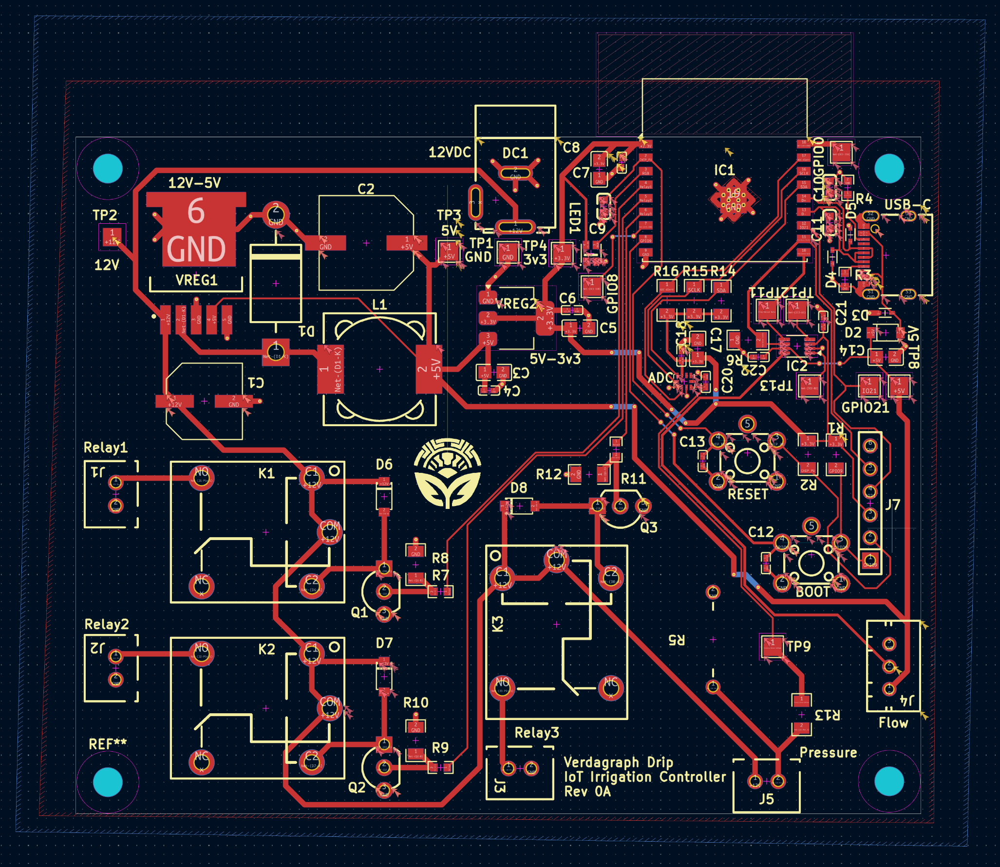
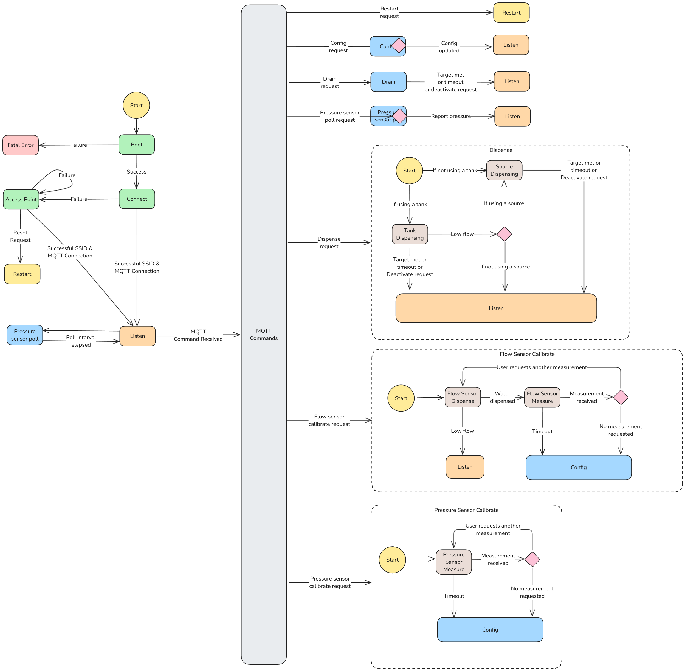

<!-- PROJECT SHIELDS -->
<!--
*** I'm using markdown "reference style" links for readability.
*** Reference links are enclosed in brackets [ ] instead of parentheses ( ).
*** See the bottom of this document for the declaration of the reference variables
*** https://www.markdownguide.org/basic-syntax/#reference-style-links
-->

[![Version][version-shield]][version-url]
[![Issues][issues-shield]][issues-url]
[![Pull Requests][prs-shield]][prs-url]

<!-- PROJECT LOGO -->
 

  

<h3 align="center">Verdagraph - Web Application</h3>

  

    A garden productivity tool, agro-ecology model, and IoT platform
    for a sustainable and cooperative future.
     
    <!-- 
    <a href=""><strong>Try it yourself »</strong></a>
     
    -->
     
    <a href="https://discord.gg/U8ps6YCc">Discord</a>
    <!-- 
    ·
    <a href="https://youtu.be/jGFHhRVdxRM">YouTube</a>
    ·
    <a href="">Donate</a>
    --> 
     
  

See the [main project readme](https://github.com/Verdagraph) for background on this repository.

The Drip is an IoT irrigation controller intended to automate the management of fixed-pressure water supplies along with variable-pressure / gravitypfed rain catchement systems. Its current scope is to control dispensing water from one rain barrel and one fixed pressure supply, using a flow meter to track precise targets, and a pressure sensor to track the water level of the catchement system, and an ESP32.

This repository contains the ESP-IDF firmware, PCB design, BOM, and instructions for setting up the system. 

Possible improvements, in no particular order:
    - Creating a solar charging version with included circuitry and deep sleep mode.
    - Support using more than one of each type of water supply.
    - Control 12V pumps in case gravity-fed isn't possible.

## PCB Design

## Firmware Design

# Contributing

See the [contributing](./contributing.md) for instructions on contributing and setting up the development environment.

<!-- MARKDOWN LINKS & IMAGES -->
<!-- https://www.markdownguide.org/basic-syntax/#reference-style-links -->

<!-- IN-REPO -->

[version-shield]: https://img.shields.io/badge/version-0.0.1-blue?style=for-the-badge
[version-url]: https://github.com/Verdagraph/Drip/releases
[issues-shield]: https://img.shields.io/github/issues/Verdagraph/Drip.svg?style=for-the-badge
[issues-url]: https://github.com/Verdagraph/Drip/issues
[prs-shield]: https://img.shields.io/github/issues-pr/Verdagraph/Drip.svg?style=for-the-badge
[prs-url]: https://github.com/Verdagraph/Drip/pulls
[license-shield]: https://img.shields.io/github/license/Verdagraph/Drip.svg?style=for-the-badge
[license-url]: https://github.com/Verdagraph/Drip/LICENSE.txt